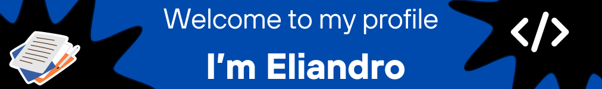

    

<table align="right">
 <tr><td><a href="https://github.com/eliandronascimento/eliandronascimento/blob/main/README-en.md"> English</a></td></tr>
 <tr><td><a href="https://github.com/eliandronascimento/eliandronascimento/blob/main/README.md">  Português</a></td></tr>
</table>

<h2 align="center">"Dreaming big or dreaming small takes the same amount of work"</h2>

Jorge Paulo Lemann

## 🚀 About Me
🎓 **Economist** graduated from the Federal University of Ceará (UFC)  
🛠️ **Experience** of over 3 years in sales and customer success  
💼 **Volunteer** at Grupo +Unidos  
🌱 **Passionate about continuous learning and innovation**  
🎯 **Objective:** Contribute to transforming Brazil into a better country

## 🔧 Technologies & Tools

## 📈 GitHub Stats

## 🔗 Connect with Me

## 💬 Get in Touch
If you want to discuss collaboration opportunities or have any questions, feel free to reach out!

  

---

*This README was generated with inspirations from some of the best GitHub profiles, including [abhisheknaiidu](https://github.com/abhisheknaiidu), [martinheinz](https://github.com/MartinHeinz), and [kautukkundan](https://github.com/kautukkundan).*

